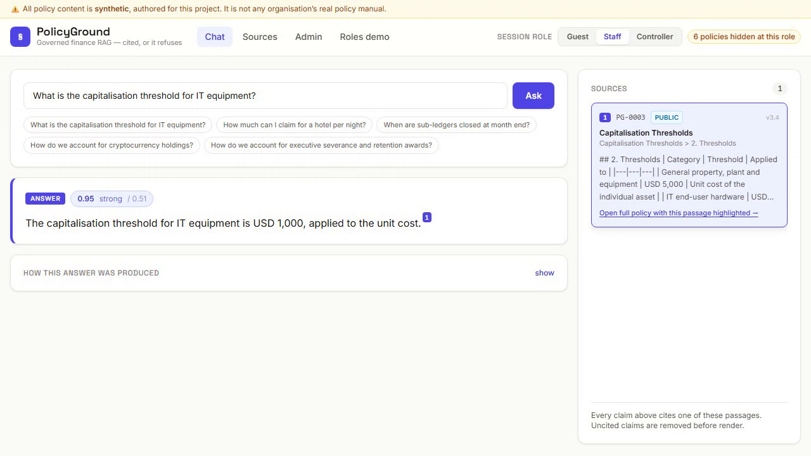
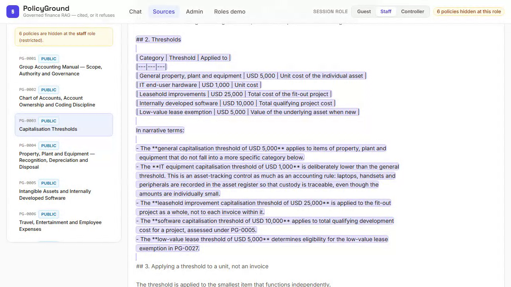
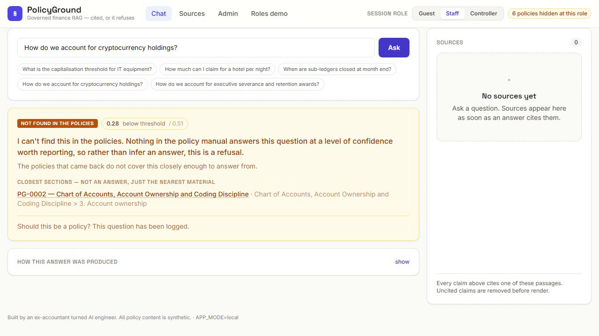
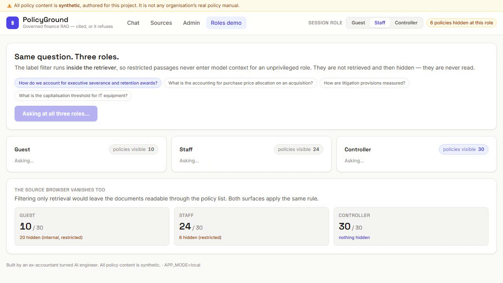
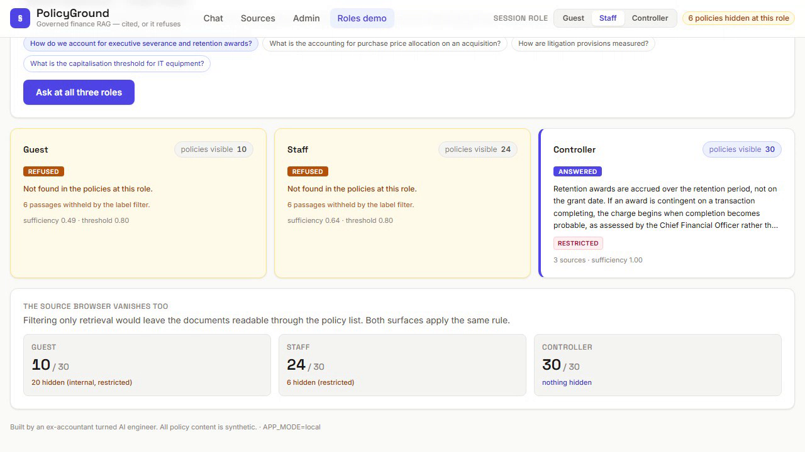

# PolicyGround

**Governed finance RAG: every claim is cited, weak retrieval refuses, sensitivity labels decide
what is retrievable at all, and groundedness is gated in CI.**



The four stills below are frames from a 60-second walkthrough — cited answer → citation
click-through → refusal → unanswered log → the same question at three roles. All of it was
recorded against the running system with the live model; nothing in it is mocked.

| | |
|---|---|
|  |  |
| The cited passage, located by stored character offset | A refusal — never styled like an answer |
|  |  |
| Repeats fold onto one row: a roadmap, not a list | Same question, same code — only the role differs |

> ⚠️ **All policy content in this repository is synthetic.** The 30-policy accounting manual under
> `corpus/` was authored for this project. It is not any organisation's real policy, and no
> accounting-standard text is reproduced.

---

## Architecture

```
                        ┌─────────────────────────────────────────┐
   Chat · Sources        │  LangGraph RAG graph (spec 08 §8)       │
   Admin · Roles   ⇄ FastAPI ⇄                                     │
   (Vite + React)        │  retrieve ──► assess_sufficiency         │
                         │      │              │                   │
                         │      │              ├─► refuse ──► END  │
                         │      │              ▼                   │
                         │      │           compose                │
                         │      │              ▼                   │
                         │      │        citation_check ──► END    │
                         └──────┼──────────────────────────────────┘
                                │
                    ┌───────────┴────────────┐
                    │   Retriever (Protocol) │   ← label filter lives HERE
                    └───────────┬────────────┘
              APP_MODE=local ───┴─── APP_MODE=azure
                    │                        │
        BM25 + vector + RRF          Azure AI Search
        (in-process, no cloud)       (hybrid, OData label filter)
                    │                        │
                    └──────► logs ◄──────────┘
                        SQLite / Postgres
```

**One `Retriever` interface, two implementations.** Everything downstream — compose, the citation
strip, refusal, the evals, the UI — is identical in both modes and cannot tell which retriever it
got. `APP_MODE` is read in exactly one function.

---

## STATUS — read this before quoting anything

| | |
|---|---|
| **LOCAL mode** | ✅ Complete, running, tested. 377 tests green. |
| **AZURE mode** | 🟡 **Deployment-ready. Never deployed.** No Azure subscription in this build environment (`BLOCKERS.md` B2). Bicep compiles in CI; the retriever is covered by contract tests with the SDK mocked. |
| **Model credentials** | ✅ Live (`BLOCKERS.md` B1, closed). Retrieval uses `text-embedding-3-small`; compose uses **`gpt-5.6-luna`** at `reasoning_effort=low`. `/api/health` reports `degraded: false`. |
| **The numbers below** | ⚠️ **Are the offline figures**, produced by `HashEmbedder` + the extractive composer — the configuration CI runs in. The same bank re-measured against the real stack is in **`docs/evals_methodology.md` §3a**, published side by side rather than swapped in. |

**Read that last row before quoting a number.** Both sets are real; they describe two different
retrieval stacks, and they are deliberately not blended.

The short version of the re-run: with `text-embedding-3-small` the calibrated threshold moves from
**0.80 to 0.51**, and the false refusal rate falls from **0.2143 to 0.0476**. The threshold turns
out to be a property of the *retrieval stack*, not of the product — 0.51 against the hash embedder
refuses only 0.355 of the unanswerable cases, so neither value is correct for both. The committed
default stays at 0.80 because that is the configuration this ships in.

**What the credential does and does not change.** The two controls this project actually stands
on — citation validity and label leakage — are *structural*: they are properties of the code, not
of retrieval quality, and they are unaffected either way. Refusal correctness *is* sensitive to
embedding quality, which is precisely why the measured figures below are described as honest
floors rather than the system's ceiling.

---

## Measured results

Gate split — 55 cases, 73 runs, a split the refusal threshold has **never been tuned on**.
Full methodology, the calibration sweep and a per-case failure analysis: **`docs/evals_methodology.md`**.

| Metric | Result | Bar |
|---|---|---|
| **Citation validity** | **1.0000** (160 claims, 0 unsupported) | absolute, must be 1.0 |
| **Label leaks** | **0** | absolute, must be 0 |
| **Restricted answered for controller** | **1.0000** | absolute — the positive control |
| Refuses the unanswerable | 0.7742 | regression floor 0.70 |
| False refusal rate | 0.2143 | regression floor 0.28 |
| Groundedness (offline proxy) | 1.0000 | secondary — see caveat below |
| **Injection cases** | **13/13 × 2 roles pass** | zero restricted chunks in context, zero canaries in output |

Two caveats stated up front rather than buried:

- **The groundedness 1.0000 is close to vacuous.** The extractive composer emits verbatim spans, so
  token overlap with the cited passage is ~1.0 by construction. What it genuinely tests is that the
  right citation is attached to the right span.
- **The threshold overfits.** Calibration said 0.941/0.136; the untouched gate split says
  0.774/0.214. That gap is published rather than closed by re-tuning, because re-tuning on the gate
  split would destroy the only honest number in the file.

---

## RAG that refuses to answer, and why that is the feature

Ask this system something the manual does not cover and it says so. That is not a limitation
worked around — it is the product.

Enterprise RAG stalls on trust, and it stalls in a specific way: a confident, fluent, well-formatted
answer that no document supports. The reader has no way to tell it apart from a good one. Every
control here exists to make that outcome *unreachable*, not unlikely:

**A refusal is a first-class outcome, not an error.** It returns HTTP 200. It is a distinct type in
the API — `Refusal` has no `claims` field at all — so a client cannot render it as an answer even by
accident. Spec 08 asks for refusals to be "styled distinctly, never like a normal answer"; here that
is enforced by the type system and asserted by a test that checks a refusal renders **no**
answer-shaped container.

**Refusing is cheap.** The graph refuses *before* calling a model. An off-corpus question costs one
retrieval and zero tokens, which means the economics point the same way as the correctness argument.

**There are two independent paths to a refusal.** Weak retrieval refuses before compose. And if the
model composes something whose claims are all uncited or cite passages that do not exist, the strip
removes them and the response *becomes* a refusal. "No answer without citations" holds even when
retrieval looked fine and the model then failed to ground itself.

**Every refusal is logged.** Spec 08 calls the unanswered log a feature; the launch framing calls it
"a roadmap for policies you're missing". Repeats fold onto one row with a counter, so the log is
ranked by how often something was asked. A flat list of 400 one-off questions is noise. The same
question asked eleven times is a policy that needs writing.

---

## Governed RAG vs commodity RAG

Retrieval-augmented generation is commodity. What is not commodity is being able to say *why* you
believe an answer, and to prove the system cannot do the thing you are afraid of.

| | Commodity RAG | PolicyGround |
|---|---|---|
| **Citations** | Requested in the prompt; usually present | **Required by the schema, enforced after the model.** `strip_uncited` removes claims citing nothing *and* claims citing ids that were never retrieved. A fabricated id renders identically to a real one — dropping only the first class lets the more convincing failure through. |
| **No answer found** | A plausible answer from loosely related chunks | An explicit refusal, the closest sections, and a row in the unanswered log |
| **Access control** | Filter results after retrieval, or not at all | **Filter inside the retriever, before scoring.** Restricted text is never read, never in a prompt, never in a log. The `Retriever` interface has no `include_restricted` flag — the bypass an injection looks for does not exist. |
| **Evaluation** | A demo and a vibe | Five gated metrics on a held-out split, with the calibration/gate gap published |
| **Judge** | Whatever model is handy today | Pinned to a dated snapshot, content-addressed cache, cache-only in CI where a miss is **fatal** — a neutral default would let the suite pass while measuring nothing |
| **Honesty** | Screenshots | A `STATUS` section, a `BLOCKERS.md`, and a methodology page that says which numbers are weak and why |

The last row is the one that took the most work. It is easy to build a demo that looks like this.
It is harder to build one that tells you where it is weak.

---

## Quickstart

**Windows** (this repo was built on Windows; `make` is not installed there — `BLOCKERS.md` B3):

```powershell
./make.ps1 install     # uv sync + npm install
./make.ps1 ingest      # build the retrieval index from corpus/
./make.ps1 dev         # API on :8000, SPA on :5173
```

**macOS / Linux:**

```bash
make install && make ingest && make dev
```

Set `OPENAI_API_KEY` in `.env` to run on `gpt-5.6-luna`. **No API key is required** — without one
the whole product still runs, fully offline on documented fallbacks, and tells you so in the
terminal and in a badge on every screen.

### The 60-second demo

1. Ask **"What is the capitalisation threshold for IT equipment?"** → a cited answer. Click a
   superscript; the sources panel highlights. Click through; the exact passage is highlighted in
   the full policy.
2. Ask **"How do we account for cryptocurrency holdings?"** → an amber refusal, the closest
   sections, and the question in the Admin screen's unanswered log.
3. Open **Roles demo** and ask about executive severance → the controller gets a cited answer from
   a `restricted` policy. Guest and staff get a refusal, and are told *how many* passages were
   withheld — never which.

### Other commands

```bash
./make.ps1 test        # 254 unit tests (LLM mocked)
./make.ps1 eval        # the five gates on the held-out split
./make.ps1 check       # lint + typecheck + tests + evals
uv run pg corpus check # cross-policy consistency, canaries, cross-references
```

---

## How the guarantees are enforced

| Claim | Where it lives | What proves it |
|---|---|---|
| Every rendered claim is cited | `answers/citation_check.py` — a pure function | `tests/test_citation_check.py`, driven by **hand-written adversarial model output**, because the offline composer cannot fabricate an id and testing against it would prove nothing |
| Restricted text never enters context | `retrieval/local_retriever.py`, filter applied before scoring | `evals/test_label_leakage.py` + a positive control; canary strings make it an exact assertion |
| The corpus does not contradict itself | `corpus/constants.yaml` + `pg corpus check` | 8 mutation tests that break the corpus deliberately and assert the checker catches it |
| Both modes behave the same | one `Retriever` Protocol | `tests/test_retriever_contract.py` runs the same assertions against both |
| The graph matches the spec diagram | `graph/build.py` | `test_node_path_matches_the_spec_diagram` asserts the recorded node path |

---

## Repository map

```
corpus/          30 synthetic policies + constants.yaml (shared-facts registry) + canaries.yaml
backend/         FastAPI · LangGraph · retrieval (local + azure) · citation enforcement · data model
frontend/        Vite + React SPA · aurora components · 4 screens
evals/           question bank · pinned judge + cache · 5 gate files · injection corpus
infra/           Bicep for AZURE mode (compiles in CI, never deployed)
docs/            architecture · evals methodology · corpus authoring · threat model · the 3 specs
```

Key documents: **`PLAN.md`** (the living plan, phases and 30 decisions) · **`BLOCKERS.md`** (what
could not be done and what shipped instead) · **`docs/evals_methodology.md`** (how every number was
produced) · **`DEPLOY_RUNBOOK.md`** · **`MODEL_COSTS.md`**.

---

## Licence

MIT. Built by an ex-accountant turned AI engineer.
